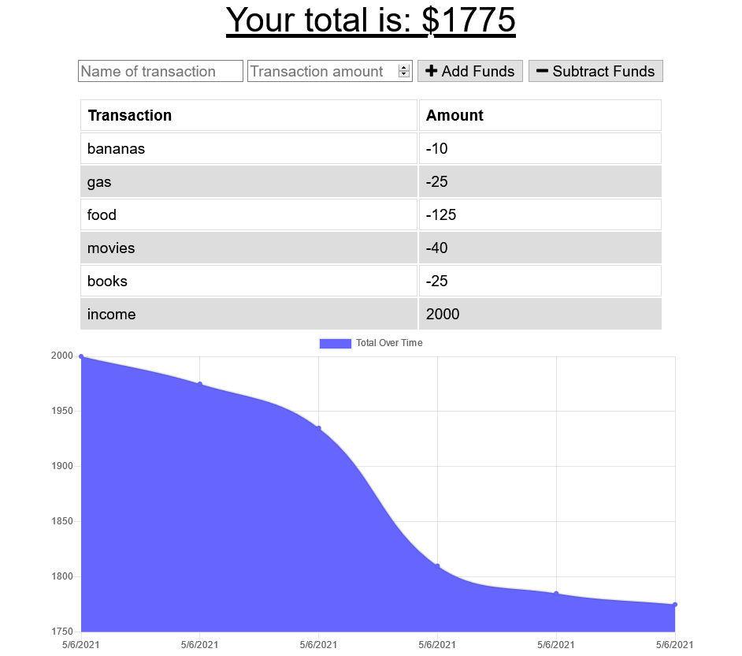

# Budget_Tracker
Budget Tracker for tracking your budget online or offline.
## Table of Contents
- [Live Link](#Live-Link)
- [Repository Link](#Repository-Link)
- [Code Description](#Code-Description)
- [Installation](#Installation)
- [Function](#Function)
- [Screenshots](#Screenshots)
## Live Link
https://damp-caverns-76168.herokuapp.com/
## Repository Link
https://github.com/riraq/Budget_Tracker
## Code Description
The front end and backend code was provided and it was requested that application be refactored to allow PWA capabilities as well as using IndexDB to allow for changes to be made whether a connection to the server was available or not. A webmanifest also needed to be included. The application uses MongoDB Atlas to save the transactions when online.
## Installation
### Local Install
1. Clone the repository from https://github.com/riraq/Budget_Tracker.
2. Run "npm i" in the main directory of the application in order to install dependencies.
### PWA Install
1. Open the application in Google Chrome at https://damp-caverns-76168.herokuapp.com/.
2. On a desktop, there will be an icon in the url bar that allows you to install it. 
3. On a smartphone, tap on "Add to home screen" to install.
## Function
The application is used to track a budget and for this particular user story, it is meant to be used while travelling. Because of this, it needs online/offline functionality. The user can input their transaction name and the cost of it and then choose whether it should be added or subtracted from their funds. When a transaction is submitted, it updates both the table on the page as well as the chart showing the change in funds.
## Screenshots
### Home Page 

